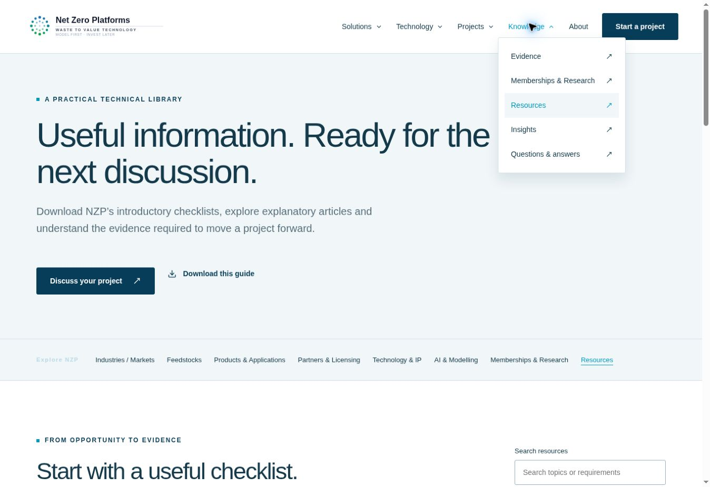

# NZP Technology

Net Zero Platforms website and project-screening app.

Production: https://nzptechnology.vercel.app

## Local development

```sh
npm ci
npm run dev -- --host 127.0.0.1
npm run build
```

React 19, Vite development server, esbuild production bundling, React Router and Lucide. Production builds prerender the public routes for search engines and generate a sitemap. Source changes on `main` deploy through the linked Vercel project.

## Content and features

- Customer-led homepage and six solution routes.
- Eight additional sections: Industries / Markets, Feedstocks, Products & Applications, Partners & Licensing, Technology & IP, AI & Modelling, Memberships & Research and Resources.
- Grouped dropdown navigation, searchable topic cards, assessment checklists and introductory plain-text guides.
- 29 prerendered public routes with page metadata and sitemap.
- Industrial platform architecture, project-development stages and evidence classification.
- Editable illustrative economics tool; no NZP yield predictions.
- Three-step project enquiry with input validation, attachment selection, review, downloadable brief and success/error states.
- Existing NZP Formspree destination: https://formspree.io/f/mreobzra.
- Technical guide, FAQ, four explanatory insight articles, privacy information and original brand assets.
- Responsive navigation, accessible labels, keyboard platform tabs and reduced-motion support.
- Vercel security headers, no optional trackers, no private source attachments in the public build.

## Editing

Content is version-controlled in `src/content.js` and `src/sections.js`; page copy and layout are in `src/App.jsx`. Styling is in `src/styles.css`. An authenticated CMS, CRM and optional analytics are not configured. A bespoke administration interface must not expose public write access.

## Enquiry integration

The website sends FormData to NZP's existing Formspree endpoint. It shows success only after an HTTP success response. The service's attachment support, quotas, approved domains and recipient routing depend on the existing NZP account plan and settings. If the provider rejects a request, the site gives an explicit error and a downloadable brief. The project brief is not automatically saved on a backend belonging to this repository.

Do not send test leads to the live endpoint without an explicit instruction to send. UI tests can intercept the provider response to exercise success/error handling, but that does not prove email delivery or CRM storage.

## Claims and evidence

See `research/competitor-review.md` for the primary-source competitor review, website choices and the evidence still required. Project figures, operating examples and partner relationships should only be added after substantiation. No patent-ownership or regulator-approval claim is published.

The plant illustration is an AI-generated architectural concept, not an operating NZP plant or engineering specification. It is labelled accordingly. `public/logo.svg` and the white version are taken from the existing NZP website.

## Expansion verification

Production navigation, all eight additional pages, search filtering, empty results and expandable checklists were checked in the browser. All 44 internal link and asset targets resolved in the production build. The new pages generated no application console errors during the walkthrough.

AI & Modelling describes decision support and links to the illustrative calculator; no AI engineering service is connected. Membership, patent and named supplier claims remain dependent on confirmed records.



## Release notes

The existing netzeroplatforms.com domain has not been moved. This project is published on a separate Vercel URL for review. Domain migration, additional authenticated CMS/CRM integrations and any production test enquiry should be separately planned.
